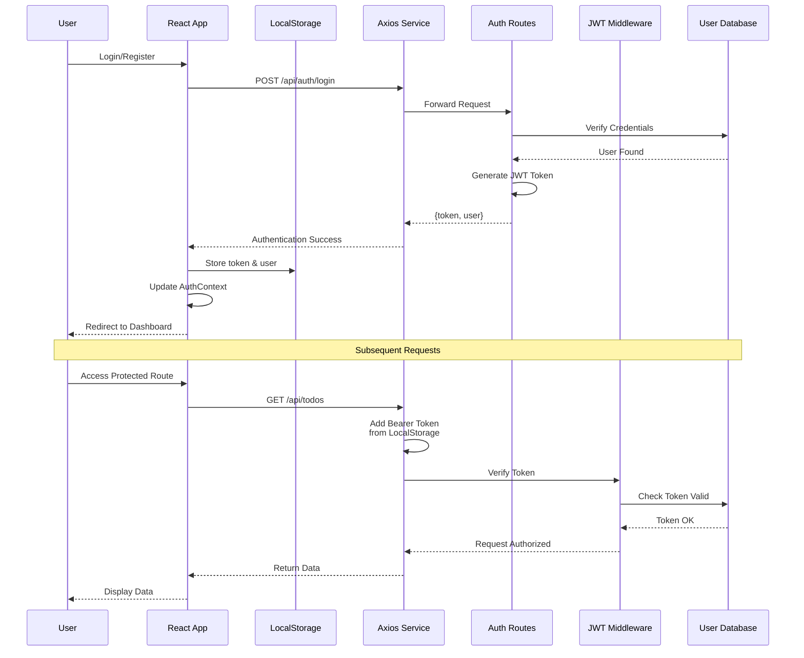
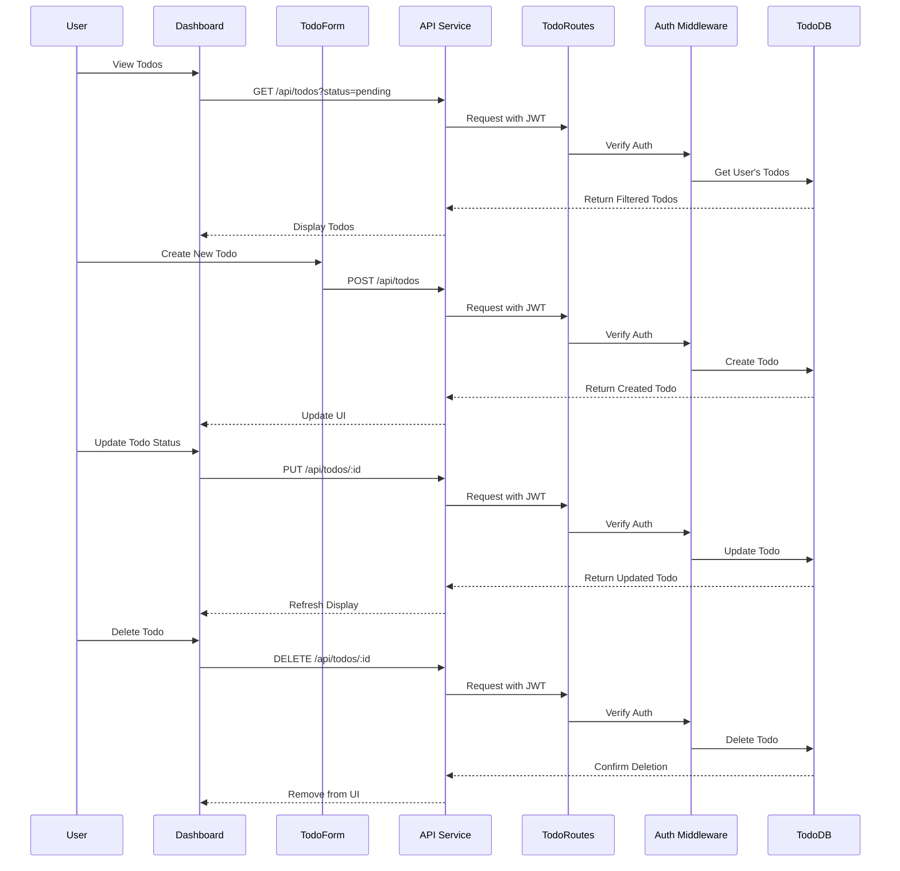
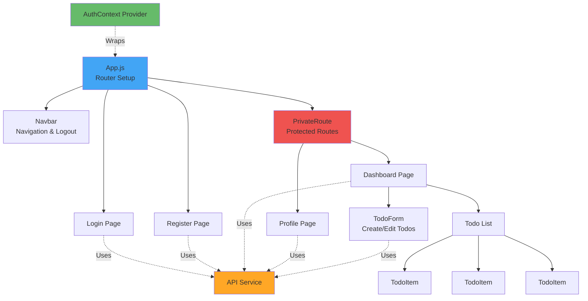
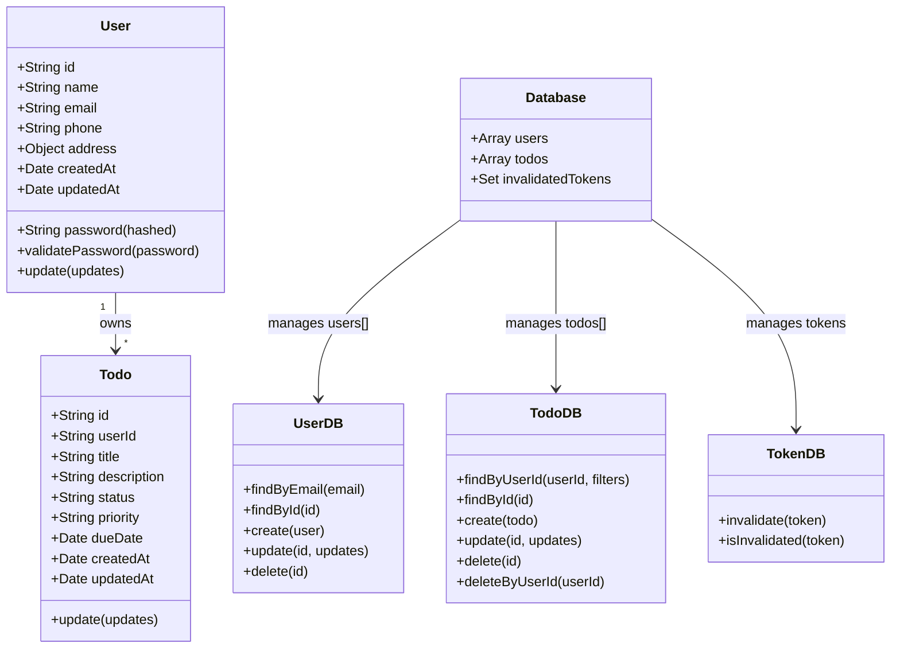
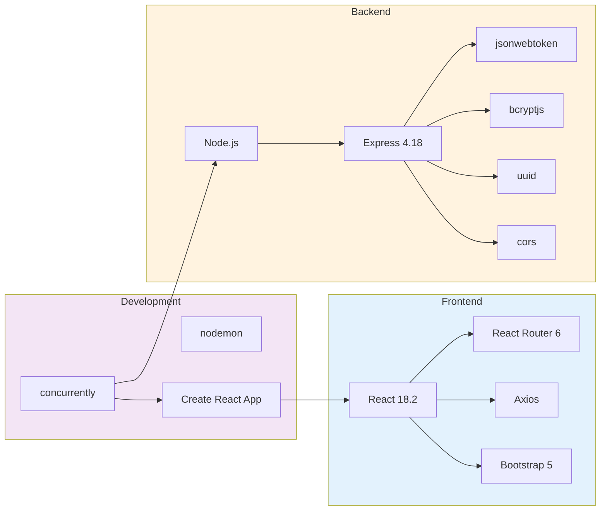

# Todo Management Application

A full-stack todo management application built with Node.js, Express, React, and Bootstrap. This application follows a monorepo structure with separate backend and frontend directories.

## Features

### Backend Features
- RESTful API built with Express.js
- JWT-based authentication
- In-memory database (arrays) for users and todos
- User registration and login
- Full CRUD operations for todos
- User profile management
- Password hashing with bcrypt
- Todo filtering by status and priority
- Pagination support

### Frontend Features
- React.js with React Router for navigation
- Responsive UI with Bootstrap 5
- User authentication (login/register)
- Todo management dashboard
- Create, read, update, and delete todos
- Filter todos by status and priority
- User profile management
- Axios for API requests
- Protected routes

## Project Structure

```
todoapp_nodejs/
├── server/                 # Backend directory
│   ├── models/            # Data models (User, Todo)
│   ├── routes/            # API routes
│   ├── middleware/        # Authentication middleware
│   ├── utils/             # Database utilities
│   ├── server.js          # Main server file
│   └── package.json       # Backend dependencies
├── client/                # Frontend directory
│   ├── public/           # Static files
│   ├── src/
│   │   ├── components/   # React components
│   │   ├── pages/        # Page components
│   │   ├── services/     # API service with Axios
│   │   ├── context/      # Auth context
│   │   ├── App.js        # Main App component
│   │   └── index.js      # Entry point
│   └── package.json      # Frontend dependencies
├── openapi.yaml          # OpenAPI specification
├── CLAUDE.md             # Project instructions
├── package.json          # Root package.json for monorepo
└── README.md             # This file
```

## Technologies Used

### Backend
- **Node.js** - JavaScript runtime
- **Express.js** - Web framework
- **bcryptjs** - Password hashing
- **jsonwebtoken** - JWT authentication
- **uuid** - Unique ID generation
- **cors** - Cross-origin resource sharing

### Frontend
- **React** - UI library
- **React Router** - Client-side routing
- **Axios** - HTTP client
- **Bootstrap 5** - CSS framework

## Architecture Diagrams

### System Architecture

```mermaid
graph TB
    subgraph Client["React Frontend (Port 3001)"]
        UI[UI Components]
        Pages[Pages<br/>Login/Register/Dashboard/Profile]
        Components[Components<br/>TodoItem/TodoForm/Navbar]
        AuthContext[AuthContext<br/>Global Auth State]
        APIService[API Service<br/>Axios Instance]
        LocalStorage[(localStorage<br/>token & user)]
    end

    subgraph Server["Express Backend (Port 3000)"]
        ExpressApp[Express App<br/>server.js]
        AuthRoutes[Auth Routes<br/>/api/auth/*]
        TodoRoutes[Todo Routes<br/>/api/todos/*]
        UserRoutes[User Routes<br/>/api/users/*]
        AuthMiddleware[Auth Middleware<br/>JWT Verification]

        subgraph Models["Models"]
            UserModel[User Model]
            TodoModel[Todo Model]
        end

        subgraph Database["In-Memory Database"]
            UserDB[userDB<br/>Helper Functions]
            TodoDB[todoDB<br/>Helper Functions]
            TokenDB[tokenDB<br/>Token Invalidation]
            UsersArray[(users[])]
            TodosArray[(todos[])]
            InvalidTokens[(invalidatedTokens<br/>Set)]
        end
    end

    UI --> Pages
    UI --> Components
    Pages --> AuthContext
    Components --> AuthContext
    Pages --> APIService
    Components --> APIService
    AuthContext --> LocalStorage
    APIService --> LocalStorage

    APIService -->|HTTP Requests<br/>Proxy to :3000| ExpressApp

    ExpressApp --> AuthRoutes
    ExpressApp --> TodoRoutes
    ExpressApp --> UserRoutes

    AuthRoutes --> UserModel
    TodoRoutes --> AuthMiddleware
    UserRoutes --> AuthMiddleware

    AuthMiddleware --> TokenDB

    TodoRoutes --> TodoModel
    UserRoutes --> UserModel

    UserModel --> UserDB
    TodoModel --> TodoDB

    UserDB --> UsersArray
    TodoDB --> TodosArray
    TokenDB --> InvalidTokens

    style Client fill:#e3f2fd
    style Server fill:#fff3e0
    style Database fill:#f3e5f5
    style Models fill:#e8f5e9
```

### Authentication Flow



### Todo CRUD Operations Flow



### Component Hierarchy



### Data Models



### Technology Stack



## Installation

### Prerequisites
- Node.js (v14 or higher)
- npm (v6 or higher)

### Install Dependencies

From the root directory, run:

```bash
npm install
npm run install-all
```

This will install dependencies for both the server and client.

## Running the Application

### Development Mode (Recommended)

Run both server and client concurrently:

```bash
npm run dev
```

This will:
- Start the backend server on `http://localhost:3000`
- Start the React development server on `http://localhost:3001`

### Run Server Only

```bash
npm run server
# or for development with auto-reload
npm run server-dev
```

### Run Client Only

```bash
npm run client
```

## API Endpoints

Base URL: `http://localhost:3000/api`

### Authentication Endpoints

- `POST /auth/register` - Register a new user
- `POST /auth/login` - Login user
- `POST /auth/logout` - Logout user (requires authentication)

### Todo Endpoints

- `GET /todos` - Get all todos (with optional filters)
- `POST /todos` - Create a new todo
- `GET /todos/:id` - Get a specific todo
- `PUT /todos/:id` - Update a todo
- `DELETE /todos/:id` - Delete a todo

### User Profile Endpoints

- `GET /users/profile` - Get user profile
- `PUT /users/profile` - Update user profile
- `DELETE /users/profile` - Delete user account

All todo and user profile endpoints require JWT authentication via the `Authorization: Bearer <token>` header.

## OpenAPI Specification

The complete API specification is available in `openapi.yaml`. You can view it using tools like Swagger Editor or Postman.

## Usage Guide

### 1. Register a New Account

1. Navigate to `http://localhost:3001/register`
2. Fill in the registration form with your details
3. Click "Register"
4. You'll be automatically logged in and redirected to the dashboard

### 2. Login

1. Navigate to `http://localhost:3001/login`
2. Enter your email and password
3. Click "Login"
4. You'll be redirected to the dashboard

### 3. Manage Todos

**Create a Todo:**
1. Click the "Create New Todo" button on the dashboard
2. Fill in the todo details (title, description, priority, status, due date)
3. Click "Create Todo"

**Edit a Todo:**
1. Click the "Edit" button on a todo card
2. Update the details
3. Click "Update Todo"

**Delete a Todo:**
1. Click the "Delete" button on a todo card
2. Confirm the deletion

**Filter Todos:**
- Use the status and priority dropdowns to filter your todos

### 4. Manage Profile

1. Click "Profile" in the navigation bar
2. Update your personal information
3. Change your password (optional)
4. Click "Update Profile"

### 5. Logout

Click the "Logout" button in the navigation bar

## Code Structure and Comments

All code files include detailed comments explaining:
- Purpose of each file/module
- Function descriptions with parameters and return values
- Important logic and algorithms
- API endpoint documentation

## Data Models

### User Model

```javascript
{
  id: string,
  name: string,
  email: string,
  password: string (hashed),
  phone: string (optional),
  address: {
    street: string,
    city: string,
    state: string,
    zipCode: string,
    country: string
  } (optional),
  createdAt: timestamp,
  updatedAt: timestamp
}
```

### Todo Model

```javascript
{
  id: string,
  userId: string,
  title: string,
  description: string,
  status: 'pending' | 'in-progress' | 'completed',
  priority: 'low' | 'medium' | 'high',
  dueDate: timestamp (optional),
  createdAt: timestamp,
  updatedAt: timestamp
}
```

## Security Considerations

- Passwords are hashed using bcrypt before storage
- JWT tokens are used for authentication
- Tokens are stored in localStorage
- Protected routes require valid authentication
- Tokens expire after 24 hours
- Logout invalidates tokens on the server

## Limitations

- Uses in-memory storage (data is lost on server restart)
- No database persistence
- No file upload functionality
- Basic validation (could be enhanced)

## Future Enhancements

- Add database integration (MongoDB, PostgreSQL)
- Implement email verification
- Add forgot password functionality
- Implement real-time updates with WebSockets
- Add file attachments to todos
- Implement todo sharing between users
- Add todo categories/tags
- Implement search functionality
- Add user avatars
- Implement todo reminders/notifications

## Troubleshooting

### Port Already in Use

If port 3000 or 3001 is already in use:

**Backend:** Set the PORT environment variable
```bash
cd server
PORT=3001 npm start
```

**Frontend:** The React app will prompt you to use a different port

### CORS Issues

Make sure the backend CORS is configured to allow requests from your frontend URL.

### Authentication Issues

- Clear localStorage if you experience login issues
- Check that JWT_SECRET is set (defaults to development key)
- Verify tokens are being sent in the Authorization header

## License

MIT License

## Contact

For questions or support, please contact: support@todoapp.com
